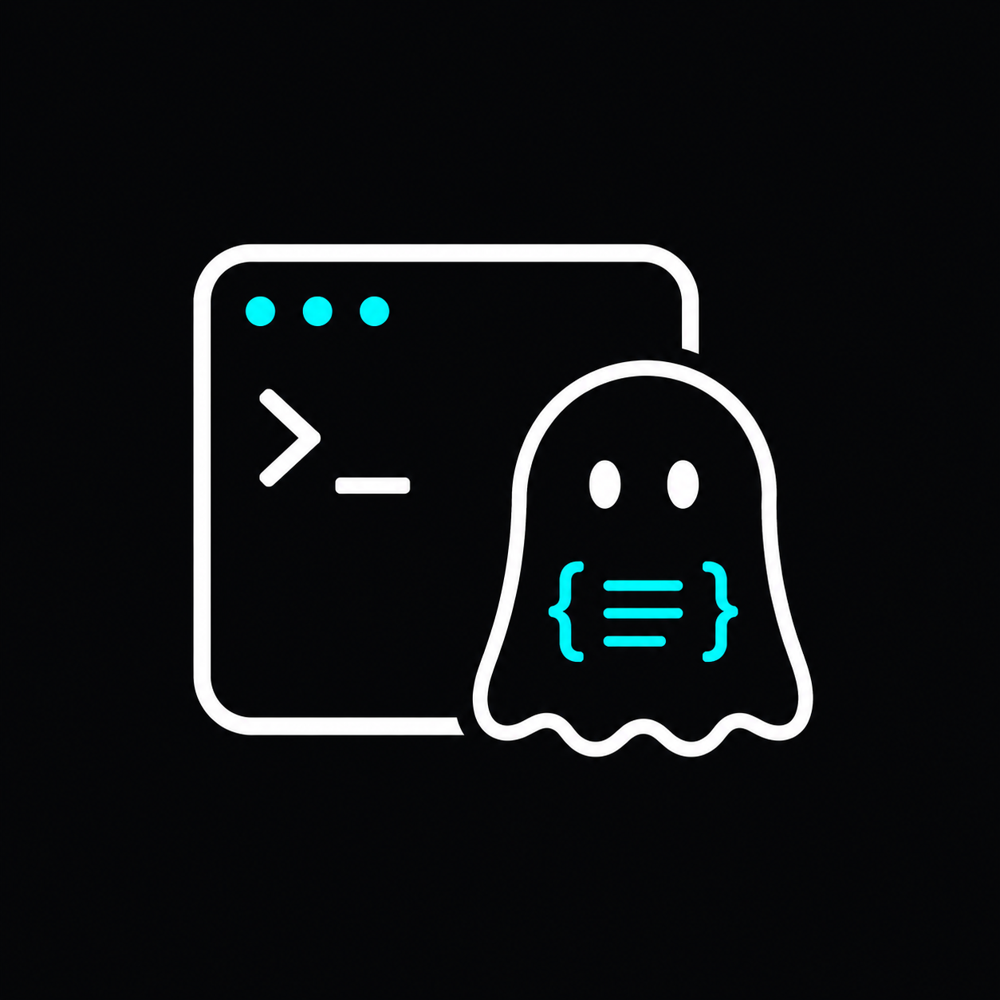

# Ghostty Configurator

A native macOS GUI for Ghostty's config — built to be indistinguishable from System Settings.



**Status:** Phase 1 — visual skeleton. Loads no real Ghostty config yet; the
Appearance pane shows the design vocabulary, every other pane is a placeholder.

## Quick start (≈ 30 seconds)

Requires macOS 14+ and Xcode 15.4+.

```bash
git clone <this repo>
cd GhosttyConfigurator
./scripts/bootstrap.sh --open
```

`bootstrap.sh` installs [XcodeGen](https://github.com/yonaskolb/XcodeGen) if
needed (`brew install xcodegen`), generates `GhosttyConfigurator.xcodeproj`
from `project.yml`, and opens it in Xcode. Then press ⌘R.

You can also build from the CLI:

```bash
./scripts/bootstrap.sh
xcodebuild -project GhosttyConfigurator.xcodeproj \
           -scheme GhosttyConfigurator \
           -configuration Debug \
           -derivedDataPath build \
           CODE_SIGNING_REQUIRED=NO CODE_SIGNING_ALLOWED=NO \
           build
open build/Build/Products/Debug/GhosttyConfigurator.app
```

## What's in here

| Path | What |
|---|---|
| `docs/00-PLAN.md` | Phased implementation plan. Read this first. |
| `docs/01-design-system.md` | SwiftUI components and design tokens. |
| `docs/02-information-architecture.md` | Sidebar + per-pane row inventory with P0/P1/P2 priority tags. |
| `docs/03-ux-principles.md` | Load-bearing UX rules (this doc wins on conflicts). |
| `docs/04-technical-architecture.md` | Performance budgets, concurrency rules, build configuration. |
| `docs/research-*.md` | Source material (don't re-read unless verifying a synthesis claim). |
| `Configs/` | `.xcconfig` files driving Debug / Release. |
| `GhosttyConfigurator/` | Swift source. App, Model, IO, DesignSystem, Views, Friendly, Resources. |
| `assets/branding/` | Source logo (1254×1254). `scripts/generate-app-icon.sh` rebuilds the icon set from this. |
| `scripts/` | `bootstrap.sh`, icon generator, ship scripts (Phase 7+). |
| `project.yml` | XcodeGen project definition. The `.xcodeproj` is git-ignored and regenerated from this. |

## Design philosophy in one paragraph

System Settings on Sonoma+ is the default rendering of
`NavigationSplitView` + `Form { Section { … } }.formStyle(.grouped)`. Apple
aligned its own app with SwiftUI defaults so third-party apps could match it
for free. Every fight you pick with the framework (custom backgrounds,
hand-drawn toggles, manual NSWindow chrome) takes you *further* from the
System Settings look. The taste move is restraint. See `docs/00-PLAN.md` §1
for the full mental model.

## License

[MIT](LICENSE).

Ghostty is © Mitchell Hashimoto — see <https://ghostty.org>. This
configurator is an independent third-party companion, not affiliated.
